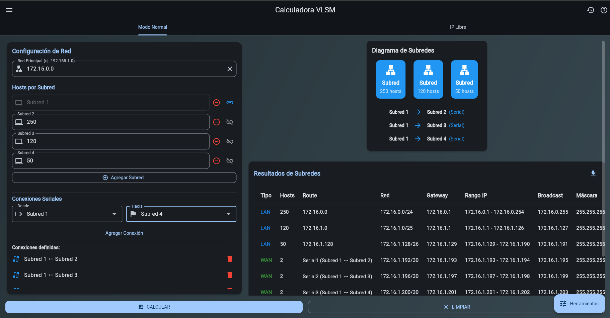
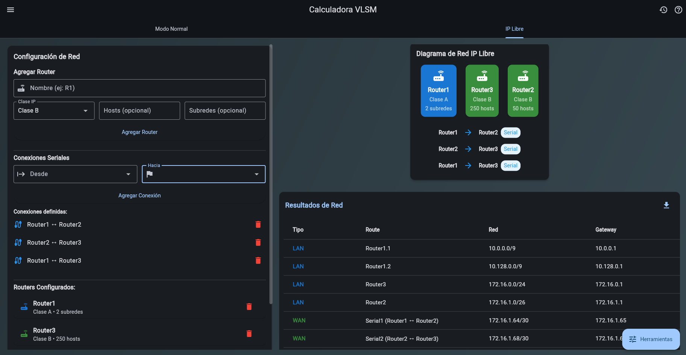
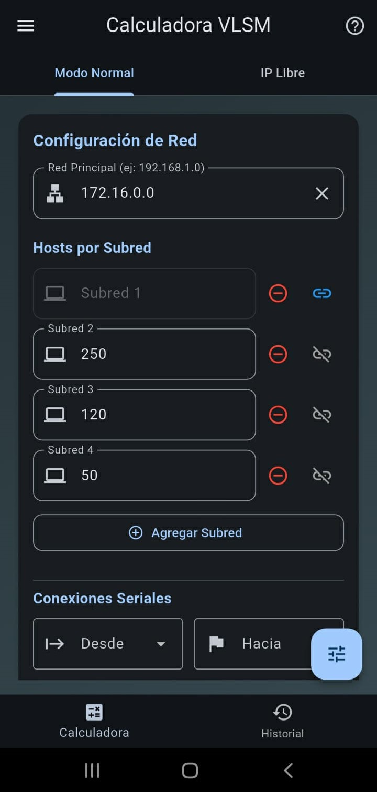
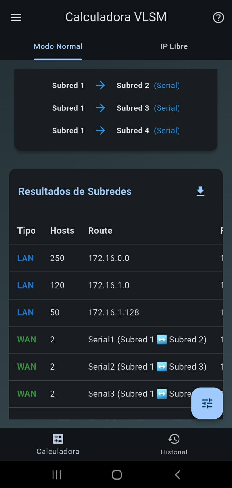
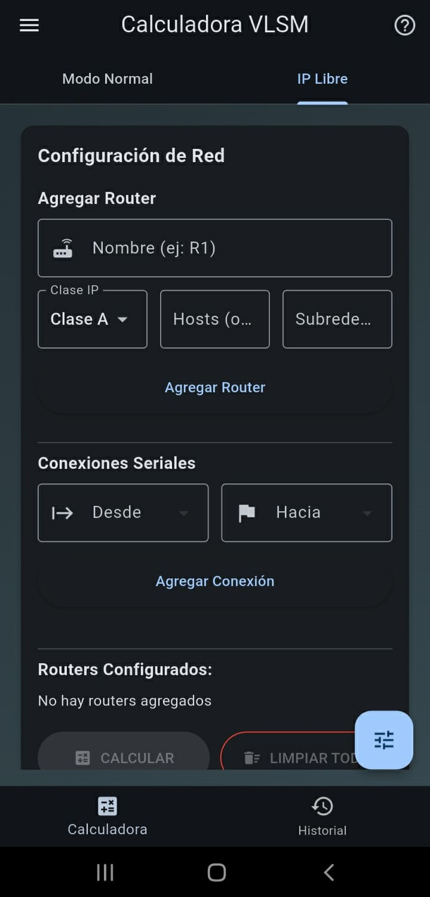
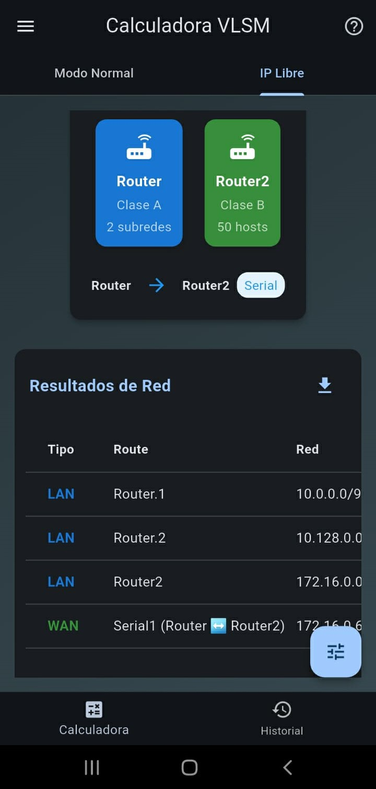

# 📡 Calculadora VLSM Avanzada

  
   
  
   
  
   
  
   
  
   
  

## 🚀 Descripción

Una calculadora avanzada de VLSM (Variable Length Subnet Mask) que permite:
- Cálculo automático de subredes con asignación eficiente de direcciones IP
- Dos modos de operación: **Normal** e **IP Libre**
- Generación de diagramas de red interactivos
- Herramientas adicionales para administradores de red

## 💻 Tecnologías

  
  
  

## 📦 Instalación

    git clone https://github.com/tu-usuario/vlsm-calculator.git
    cd vlsm-calculator
    flutter pub get
    flutter run

## 🏗️ Estructura de la Interfaz Principal

La aplicación utiliza la estructura básica de Flutter `Scaffold` con los siguientes componentes clave:

### 🖥️ **AppBar (Barra Superior)**
- Muestra el título "Calculadora VLSM"
- Contiene acciones a la derecha:
  - Icono de historial para ver cálculos anteriores
  - Icono de ayuda para acceder a documentación
- Se adapta al tema claro/oscuro del dispositivo

### 🚪 **Drawer (Menú Lateral Izquierdo)**
- Menú deslizable desde el borde izquierdo
- Contiene:
  - Cabecera con icono de red y título
  - Opción para nuevo cálculo
  - Guardar resultados actuales
  - Divisor visual
  - Explicación de funcionamiento
  - Configuración de la aplicación

### 🛠️ **EndDrawer (Menú Lateral Derecho)**
- Menú deslizable desde el borde derecho
- Agrupa herramientas adicionales:
  - Conversor IP a binario
  - Tabla de prefijos CIDR
  - Exportación de resultados

### 📱 **Body (Cuerpo Principal)**
- Área de contenido central con:
  - Fondo degradado que cambia según el tema
  - Pestañas para cambiar entre modos (Normal/IP Libre)
  - Formularios de entrada de datos
  - Visualización de resultados
  - Diagramas de red interactivos

### 📲 **BottomNavigationBar (Barra Inferior - Móvil)**
- Visible solo en dispositivos móviles
- Permite navegar rápidamente entre:
  - Calculadora principal
  - Historial de cálculos
- Reemplaza la navegación por pestañas en pantallas pequeñas

### ➕ **FloatingActionButton (Botón Flotante)**
- Botón circular flotante en esquina inferior derecha
- Acceso rápido al menú de herramientas
- Icono dinámico (herramientas/ajustes)
- Se superpone sobre el contenido principal

## 🔧 Modos de Operación

### 🔢 Modo Normal (VLSM Clásico)
✔️ Ingresa una red principal (ej: `192.168.1.0/24`)  
✔️ Especifica los hosts requeridos para cada subred  
✔️ Calcula automáticamente:  
   - Máscaras de subred óptimas  
   - Rangos de direcciones válidas  
   - Direcciones de broadcast  
   - Diagrama visual de la red  

### 🆓 Modo IP Libre Completo
✔️ Configura routers con nombres personalizados  
✔️ Selecciona clase de red (A, B o C)  
✔️ Especifica hosts o subredes requeridas  
✔️ Agrega conexiones seriales entre routers  
✔️ Genera:  
   - Asignación automática de direcciones IP  
   - Subneteos para interfaces seriales (`/30`)  
   - Diagrama completo de la topología  

## 🛠️ Herramientas Adicionales

| Herramienta          | Descripción |
|----------------------|-------------|
| 🔢 IP a Binario      | Convierte direcciones IPv4 a su representación binaria |
| 📊 Tabla de Prefijos | Muestra máscaras equivalentes y hosts disponibles para prefijos comunes |
| 📋 Exportar Resultados | Genera reportes en formato Markdown con todos los datos técnicos |

## 🎨 Características UI/UX

✨ **Interfaz responsive** que se adapta perfectamente a móviles y desktop  
📊 **Diagramas interactivos** que muestran la topología de red generada  
🔍 **Validación en tiempo real** de los datos ingresados  
📚 **Historial** que guarda tus cálculos recientes (proximamente) 

## 📝 Ejemplo de Uso

    // Modo Normal
    Red Principal: 192.168.1.0/24
    Subred 1: 50 hosts → /26 (62 hosts)
    Subred 2: 20 hosts → /27 (30 hosts)

    // Modo IP Libre
    Router R1 (Clase B) - 120 hosts
    Router R2 (Clase C) - 2 subredes
    Conexión Serial: R1 ↔ R2

## 📚 Fórmulas Clave

    Hosts disponibles => 2ⁿ - 2 ≥ nroHost
    Redes: = 2ⁿ ≥ nroSubred
    Numero magico = 256 - valor_octeto

## 📄 Licencia

**MIT License** © 2025

📜 Ver archivo [LICENSE](LICENSE) para más detalles.  

Este proyecto es de código abierto bajo los términos de la licencia MIT.  